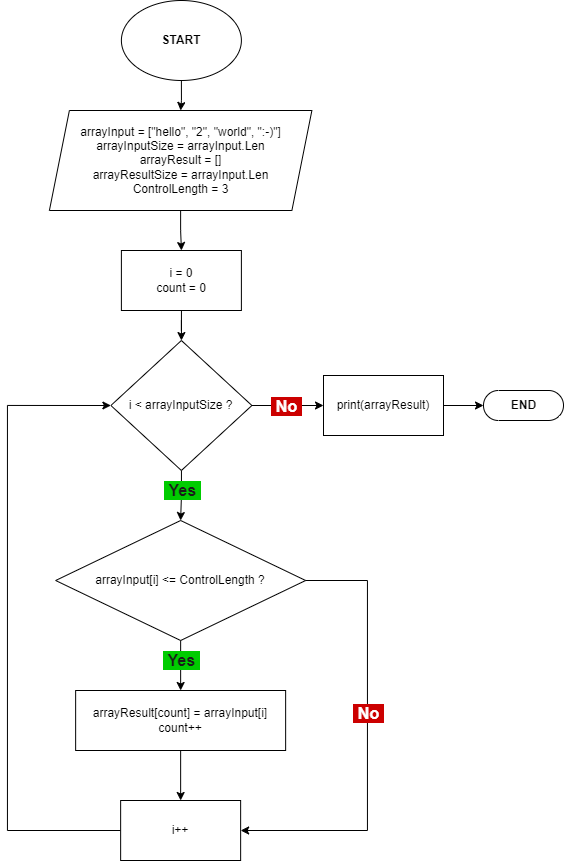

ОРИГИНАЛ

---

## Итоговая проверочная работа.

Данная работа необходима для проверки ваших знаний и навыков по итогу прохождения первого блока обучения на программе разработчик. Мы должны убедиться, что базовое знакомство с it прошло успешно. Задача алгоритмически не самая сложная, однако для полноценного выполнения проверочной работы необходимо:

1. Создать репозиторий на GitHub
2. Нарисовать блок-схему алгоритма (можно обойтись блок-схемой основной содержательной части, если вы выделяете ее в отдельный метод)
3. Снабдить репозиторий оформленным текстовым описанием решения (файл README.md)
4. Написать программу, решающую поставленную задачу
5. Использовать контроль версий в работе над этим небольшим проектом (не должно быть так что все залито одним коммитом, как минимум этапы 2, 3 и 4 должны быть расположены в разных коммитах)

Задача: Написать программу, которая из имеющегося массива строк формирует массив из строк, длина которых меньше либо равна 3 символа. Первоначальный массив можно ввести с клавиатуры, либо задать на старте выполнения алгоритма.

При решении не рекомендуется пользоваться коллекциями, лучше обойтись исключительно массивами.

__Примеры__\:

["hello", "2", "world", ":-)"] -> ["2", ":-)"]

["1234", "1567", "-2", "computer science"] -> ["-2"]

["Russia", "Denmark", "Kazan"] -> []

---

## 1\. Репозиторий на GitHub

<https://github.com/vadimmm/gb_quarter_test>

## 2\. БЛОК-СХЕМА

## 3\. README.md

Файл README.md доступен по ссылке: <https://github.com/vadimmm/gb_quarter_test/TEST%20#01/README.md>